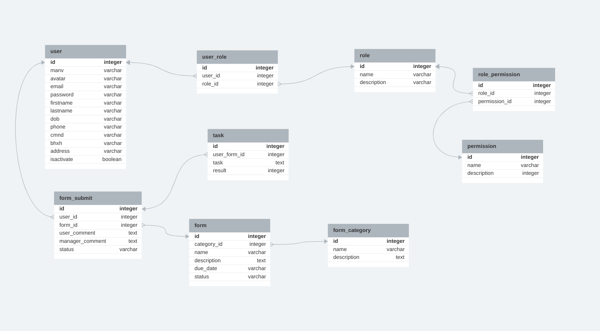

# How it works

- node ^18.6.0
- express ^4.18.2
- sequelize ^6.32.1

# Set up .env file
```
PORT=3000
JWT_KEY=YOUR_SECRET_KEY
MYSQL_HOST=localhost
MYSQL_USER=YOUR_MYSQL_USER
MYSQL_PASSWORD=YOUR_MYSQL_PASSWORD
MYSQL_DATABASE=YOUR_MYSQL_DATABASE

EMAIL=YOUR_GMAIL
MAIL_PASSWORD= generatedPassword for application in gmail 
[Click here to view the guide](https://miracleio.me/snippets/use-gmail-with-nodemailer)
```
## Installation

```bash
$ git clone
$ cd user-management2
$ npm install
```

## Running the app

```bash
# In local development
$ npm run dev
```
## Database

